# Factor Evolution Diagram

> Open this file in VS Code with Markdown preview (`Cmd+Shift+V`) to see the rendered graph.

## 📝 Original User Query

> Generate alpha factor expressions using OHLCV fields, explore momentum, reversal, volume-price interaction, and range-based patterns.

## 🏆 Top 10 Factors (Ranked by Sharpe)

| # | Sharpe | Ann.Ret | MaxDD | Turnover | IC Mean | ICIR | Iter | Expression |
|---|--------|---------|-------|----------|---------|------|------|------------|
| 1 | 0.6656 | 0.1729 | -0.3151 | 0.68 | -0.0115 | -0.0791 | 1 | `rank(delta(high,5)-delta(low,5))` |
| 2 | 0.6656 | 0.1729 | -0.3151 | 0.68 | -0.0115 | -0.0791 | 2 | `clip(rank(delta(high,5)-delta(low,5)), -3, 3)` |
| 3 | 0.6656 | 0.1729 | -0.3151 | 0.68 | -0.0115 | -0.0791 | 2 | `clip(rank(delta(high,5)-delta(low,5)), 0, 1e8) * 1.5 + clip(rank(delta(high,5)-d` |
| 4 | 0.6656 | 0.1729 | -0.3151 | 0.68 | -0.0115 | -0.0791 | 3 | `clip(rank(delta(high,5)-delta(low,5)), -3, 6)` |
| 5 | 0.6656 | 0.1729 | -0.3151 | 0.68 | -0.0115 | -0.0791 | 3 | `rank(delta(high,5)-delta(low,5)) * 1.5 + clip(rank(delta(high,5)-delta(low,5)), ` |
| 6 | 0.6178 | 0.1787 | -0.2860 | 0.88 | 0.0215 | 0.1031 | 2 | `-1*returns(close, 10)*(volume/max(ts_mean(volume, 30),1e-8))` |
| 7 | 0.5656 | 0.1480 | -0.3167 | 0.96 | 0.0197 | 0.0960 | 1 | `-1*returns(close,5)*(volume/max(ts_mean(volume,20),1e-8))` |
| 8 | 0.5656 | 0.1480 | -0.3167 | 0.96 | 0.0197 | 0.0960 | 2 | `rank(-1*returns(close,5)*(volume/max(ts_mean(volume,20),1e-8)))` |
| 9 | 0.5656 | 0.1480 | -0.3167 | 0.96 | 0.0197 | 0.0960 | 2 | `clip(-1*returns(close,5)*(volume/max(ts_mean(volume,20),1e-8)), -3, 3)` |
| 10 | 0.5365 | 0.1357 | -0.4264 | 0.59 | 0.0278 | 0.1235 | 2 | `ts_mean(-1*returns(close,5)*(volume/max(ts_mean(volume,20),1e-8)), 20)` |

```mermaid
graph LR
    N0["-1*(close-open)/(high-low+1e-8)<br/>S -0.95 | IC 0.002 | TO 0.98 | AR -0.26 | DD -0.41 (iter 1)<br/>🔴 low Sharpe  🔴 low IC  🔴 high turnover"]
    N1[" 🎯 -1*ts_sum(returns(close,1),5)<br/>S 0.35 | IC 0.019 | TO 0.94 | AR 0.06 | DD -0.30 (iter 1)<br/>🔴 high turnover  🟢 positive return"]
    N2["rank(open-delay(close,1))<br/>S -2.10 | IC 0.002 | TO 0.79 | AR -0.58 | DD -0.81 (iter 1)<br/>🔴 low Sharpe  🔴 low IC  🔴 high drawdown"]
    N3["correlation(high,volume,10)<br/>S -1.07 | IC -0.036 | TO 0.94 | AR -0.28 | DD -0.57 (iter 1)<br/>🔴 low Sharpe  🟢 high IC  🔴 high turnover  🔴 high drawdown"]
    N4["ts_mean(volume,5)/ts_mean(volume,20)<br/>S -0.40 | IC -0.017 | TO 0.90 | AR -0.18 | DD -0.46 (iter 1)<br/>🔴 low Sharpe  🔴 high turnover"]
    N5["decay_linear(correlation(close,volume,10),5)<br/>S -1.56 | IC -0.036 | TO 0.93 | AR -0.40 | DD -0.66 (iter 1)<br/>🔴 low Sharpe  🟢 high IC  🔴 high turnover  🔴 high drawdown"]
    N6["-1*(ts_max(high,10)-ts_min(low,10))/(ts_max(high,30)-ts_min(low,30)+1e-8)<br/>S -0.63 | IC 0.021 | TO 0.89 | AR -0.22 | DD -0.48 (iter 1)<br/>🔴 low Sharpe  🟢 high IC  🔴 high turnover"]
    N7["rank(ts_rank(close-open,10))<br/>S -0.08 | IC -0.010 | TO 0.90 | AR -0.05 | DD -0.30 (iter 1)<br/>🔴 low Sharpe  🔴 high turnover"]
    N8[" 🎯 -1*returns(close,5)*(volume/max(ts_mean(volume,20),1e-8))<br/>S 0.57 | IC 0.020 | TO 0.96 | AR 0.15 | DD -0.32 (iter 1)<br/>🟢 high Sharpe  🔴 high turnover  🟢 positive return"]
    N9["ts_zscore(returns(close,5),60)<br/>S -0.27 | IC -0.009 | TO 0.97 | AR -0.12 | DD -0.37 (iter 1)<br/>🔴 low Sharpe  🔴 low IC  🔴 high turnover"]
    N10[" ⭐ 🎯 rank(delta(high,5)-delta(low,5))<br/>S 0.67 | IC -0.011 | TO 0.68 | AR 0.17 | DD -0.32 (iter 1)<br/>🟢 high Sharpe  🟢 positive return"]
    N11["rank(volume/adv(20))<br/>S -1.39 | IC -0.017 | TO 0.93 | AR -0.39 | DD -0.64 (iter 1)<br/>🔴 low Sharpe  🔴 high turnover  🔴 high drawdown"]
    N12["ts_mean((close-low)-(high-close),5)/(high-low+1e-8)<br/>S -0.36 | IC -0.011 | TO 0.98 | AR -0.16 | DD -0.43 (iter 1)<br/>🔴 low Sharpe  🔴 high turnover"]
    N13["returns(close,10)*rank(amount/ts_mean(amount,20))<br/>S -1.13 | IC -0.020 | TO 0.90 | AR -0.42 | DD -0.70 (iter 1)<br/>🔴 low Sharpe  🟢 high IC  🔴 high turnover  🔴 high drawdown"]
    N14["abs(close-open)/max(high-low,1e-8)*sign(close-open)<br/>S -0.10 | IC -0.002 | TO 0.98 | AR -0.06 | DD -0.41 (iter 1)<br/>🔴 low Sharpe  🔴 low IC  🔴 high turnover"]
    N15["rank(delta(high,5)-delta(low, 10))<br/>S -0.14 | IC -0.009 | TO 0.76 | AR -0.12 | DD -0.62 (iter 2)<br/>🔴 low Sharpe  🔴 low IC  🔴 high drawdown"]
    N16["zscore(delta(high,5)-delta(low,5))<br/>S 0.00 (iter 2)<br/>🔴 low Sharpe  🔴 low IC  🟢 low turnover"]
    N17[" ⭐ 🎯 clip(rank(delta(high,5)-delta(low,5)), -3, 3)<br/>S 0.67 | IC -0.011 | TO 0.68 | AR 0.17 | DD -0.32 (iter 2)<br/>🟢 high Sharpe  🟢 positive return"]
    N18["ts_mean(rank(delta(high,5)-delta(low,5)), 20)<br/>S -0.35 | IC 0.015 | TO 0.86 | AR -0.17 | DD -0.33 (iter 2)<br/>🔴 low Sharpe  🔴 high turnover"]
    N19[" ⭐ 🎯 clip(rank(delta(high,5)-delta(low,5)), 0, 1e8) * 1.5 + clip(rank(delta(high,5)-delta(low,5)), -1e8, <br/>S 0.67 | IC -0.011 | TO 0.68 | AR 0.17 | DD -0.32 (iter 2)<br/>🟢 high Sharpe  🟢 positive return"]
    N20["ts_mean(-1*returns(close,5)*(volume/max(ts_mean(volume,20),1e-8)), 20)<br/>S 0.54 | IC 0.028 | TO 0.59 | AR 0.14 | DD -0.43 (iter 2)<br/>🟢 high Sharpe  🟢 high IC  🟢 positive return"]
    N21["-1*returns(close,5)*(volume/max(ts_mean(volume,20),1e-8))<br/>S 0.57 | IC 0.020 | TO 0.96 | AR 0.15 | DD -0.32 (iter 2)<br/>🟢 high Sharpe  🔴 high turnover  🟢 positive return"]
    N22[" 🎯 -1*returns(close, 10)*(volume/max(ts_mean(volume, 30),1e-8))<br/>S 0.62 | IC 0.021 | TO 0.88 | AR 0.18 | DD -0.29 (iter 2)<br/>🟢 high Sharpe  🟢 high IC  🔴 high turnover  🟢 positive return"]
    N23["rank(-1*returns(close,5)*(volume/max(ts_mean(volume,20),1e-8)))<br/>S 0.57 | IC 0.020 | TO 0.96 | AR 0.15 | DD -0.32 (iter 2)<br/>🟢 high Sharpe  🔴 high turnover  🟢 positive return"]
    N24["clip(-1*returns(close,5)*(volume/max(ts_mean(volume,20),1e-8)), -3, 3)<br/>S 0.57 | IC 0.020 | TO 0.96 | AR 0.15 | DD -0.32 (iter 2)<br/>🟢 high Sharpe  🔴 high turnover  🟢 positive return"]
    N25["ts_mean(-1*ts_sum(returns(close,1),5), 20)<br/>S -0.46 | IC 0.019 | TO 0.66 | AR -0.24 | DD -0.64 (iter 2)<br/>🔴 low Sharpe  🔴 high drawdown"]
    N26["decay_linear(-1*ts_sum(returns(close,1),5), 20)<br/>S -0.34 | IC 0.019 | TO 0.76 | AR -0.20 | DD -0.55 (iter 2)<br/>🔴 low Sharpe  🔴 high drawdown"]
    N27[" ⭐ clip(rank(delta(high,5)-delta(low,5)), -3, 6)<br/>S 0.67 | IC -0.011 | TO 0.68 | AR 0.17 | DD -0.32 (iter 3)<br/>🟢 high Sharpe  🟢 positive return"]
    N28["clip(zscore(delta(high,5)-delta(low,5)), -3, 3)<br/>S 0.00 (iter 3)<br/>🔴 low Sharpe  🔴 low IC  🟢 low turnover"]
    N29[" ⭐ rank(delta(high,5)-delta(low,5))<br/>S 0.67 | IC -0.011 | TO 0.68 | AR 0.17 | DD -0.32 (iter 3)<br/>🟢 high Sharpe  🟢 positive return"]
    N30["ts_mean(clip(rank(delta(high,5)-delta(low,5)), -3, 3), 20)<br/>S -0.35 | IC 0.015 | TO 0.86 | AR -0.17 | DD -0.33 (iter 3)<br/>🔴 low Sharpe  🔴 high turnover"]
    N31[" ⭐ clip(rank(delta(high,5)-delta(low,5)), -3, 3)<br/>S 0.67 | IC -0.011 | TO 0.68 | AR 0.17 | DD -0.32 (iter 3)<br/>🟢 high Sharpe  🟢 positive return"]
    N32[" ⭐ clip(rank(delta(high,5)-delta(low,5)), 0, 1e8) * 1.5 + clip(rank(delta(high,5)-delta(low,5)), -1e8, <br/>S 0.67 | IC -0.011 | TO 0.68 | AR 0.17 | DD -0.32 (iter 3)<br/>🟢 high Sharpe  🟢 positive return"]
    N33["clip(zscore(delta(high,5)-delta(low,5)), 0, 1e8) * 1.5 + clip(zscore(delta(high,5)-delta(low,5)), -1<br/>S 0.00 (iter 3)<br/>🔴 low Sharpe  🔴 low IC  🟢 low turnover"]
    N34[" ⭐ rank(delta(high,5)-delta(low,5)) * 1.5 + clip(rank(delta(high,5)-delta(low,5)), -1e8, 0) * 0.5<br/>S 0.67 | IC -0.011 | TO 0.68 | AR 0.17 | DD -0.32 (iter 3)<br/>🟢 high Sharpe  🟢 positive return"]
    N35["ts_mean(clip(rank(delta(high,5)-delta(low,5)), 0, 1e8) * 1.5 + clip(rank(delta(high,5)-delta(low,5))<br/>S -0.35 | IC 0.015 | TO 0.86 | AR -0.17 | DD -0.33 (iter 3)<br/>🔴 low Sharpe  🔴 high turnover"]
    N36[" ⭐ clip(rank(delta(high,5)-delta(low,5)), 0, 1e8) * 1.5 + clip(rank(delta(high,5)-delta(low,5)), -1e8, <br/>S 0.67 | IC -0.011 | TO 0.68 | AR 0.17 | DD -0.32 (iter 3)<br/>🟢 high Sharpe  🟢 positive return"]
    N37["ts_mean(-1*returns(close, 10)*(volume/max(ts_mean(volume, 30),1e-8)), 20)<br/>S -0.04 | IC 0.029 | TO 0.55 | AR -0.09 | DD -0.50 (iter 3)<br/>🔴 low Sharpe  🟢 high IC"]
    N38["-1*returns(close, 10)*(volume/max(ts_mean(volume, 30),1e-8))<br/>S 0.62 | IC 0.021 | TO 0.88 | AR 0.18 | DD -0.29 (iter 3)<br/>🟢 high Sharpe  🟢 high IC  🔴 high turnover  🟢 positive return"]
    N10 -->|"adjust-lookback"| N15
    N10 -->|"adjust-normalization"| N16
    N10 -->|"adjust-clipping"| N17
    N10 -->|"reduce-turnover"| N18
    N10 -->|"asymmetric"| N19
    N8 -->|"reduce-turnover"| N20
    N8 -->|"adjust-smoothing"| N21
    N8 -->|"adjust-lookback"| N22
    N8 -->|"adjust-normalization"| N23
    N8 -->|"adjust-clipping"| N24
    N1 -->|"reduce-turnover"| N25
    N1 -->|"adjust-smoothing"| N26
    N17 -->|"adjust-lookback"| N27
    N17 -->|"adjust-normalization"| N28
    N17 -->|"adjust-clipping"| N29
    N17 -->|"reduce-turnover"| N30
    N17 -->|"asymmetric"| N31
    N19 -->|"adjust-lookback"| N32
    N19 -->|"adjust-normalization"| N33
    N19 -->|"adjust-clipping"| N34
    N19 -->|"reduce-turnover"| N35
    N19 -->|"asymmetric"| N36
    N22 -->|"reduce-turnover"| N37
    N22 -->|"adjust-smoothing"| N38
```

## Metrics Legend

| Abbr | Metric | Meaning |
|------|--------|---------|
| **S** | Sharpe | Risk-adjusted return (sign = direction; negative = short signal) |
| **IC** | IC Mean | Cross-sectional rank correlation with forward returns |
| **TO** | Turnover | Fraction of positions changed between rebalance periods |
| **AR** | Annual Return | Annualized long-short portfolio return |
| **DD** | Max Drawdown | Maximum peak-to-trough decline |

## How to Read This Diagram

- **Nodes** show factor expressions, key metrics, and descriptive tags
- **⭐** marks the factor with the highest numeric Sharpe
- **🎯** marks factors **selected as parents** for the next generation
- **Arrows** show parent → child relationships with the **transformation** applied

### Tag Reference

| Color | Meaning |
|-------|---------|
| 🟢 | Good attribute |
| 🔴 | Warning / poor attribute |

**Tags:** `high Sharpe` (S≥0.5) · `low Sharpe` (S<0.2) · `high IC` (|IC|≥0.02) · `low IC` (|IC|<0.01) · `high turnover` (TO>0.85) · `low turnover` (TO<0.5) · `high drawdown` (DD<−50%) · `positive return` (AR>0)

### Transformation Reference

| Transformation | Effect | Trigger |
|---------------|--------|---------|
| `reduce-turnover` | Smooth with 20-day moving average | high turnover |
| `adjust-smoothing` | Add or remove decay-linear weighting | turnover too high or low |
| `adjust-lookback` | Adjust rolling window length by ±50% | IC too noisy or too smooth |
| `adjust-normalization` | Switch between rank, z-score, or scale | distribution skew |
| `adjust-clipping` | Clip values to bounded range | extreme outlier spikes |
| `flip-sign` | Negate the entire expression | negative Sharpe |
| `asymmetric` | Weight long side more than short side | asymmetric return profile |
| `long-only` | Keep only positive values (clip at zero) | short side underperforming |
| `short-only` | Keep only negative values (clip at zero) | long side underperforming |
| `combine-factors` | Add two z-scored factors together | two promising low-correlation factors |
| `simplify` | Remove one level of nesting | over-complex expression |
